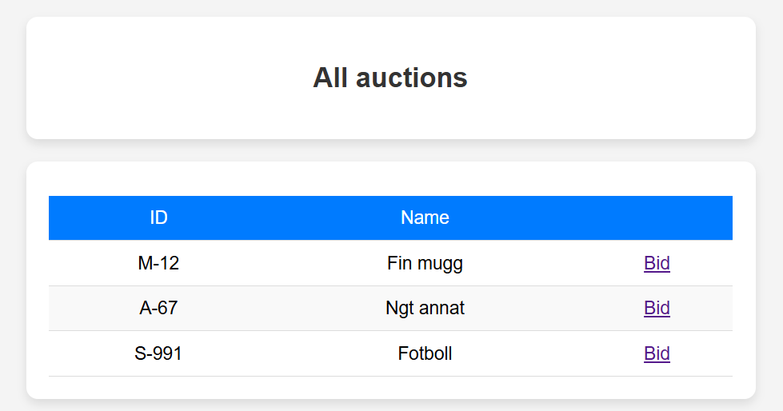
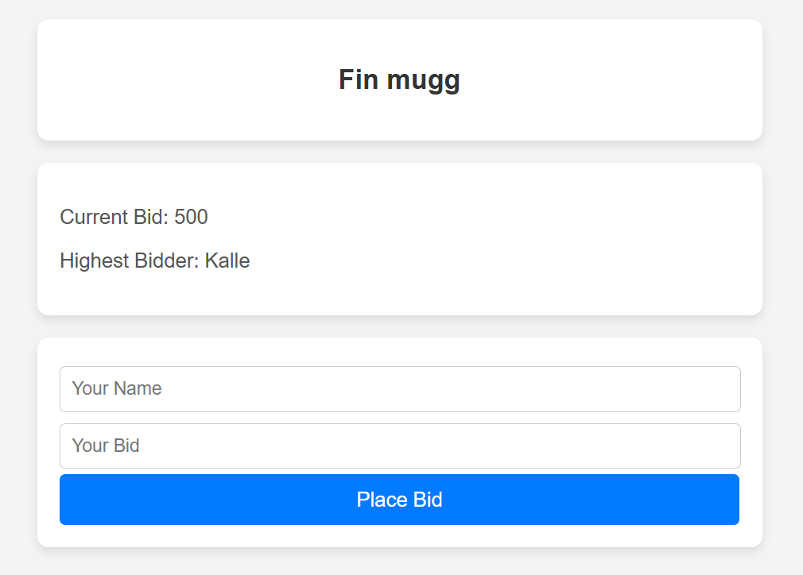

# Auction Web App

- This is a simple auction web application built with TypeScript, Express, and Socket.IO. Users can place bids on items in real-time.

## Features

- View available auctions
- Join an auction room
- Place bids via WebSocket
- Real-time bid updates

## Frontend

